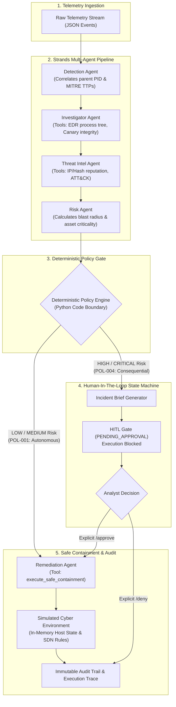

# JARVIS Sentinel — Autonomous SOC Multi-Agent System

> *"Autonomous where safe. Human-controlled where consequential."*

[](LICENSE)
[](https://www.python.org/)
[](https://github.com/strands-ai)
[](https://aws.amazon.com/bedrock/)

---

## 🛡️ Executive Summary

Security Operations Centers (SOCs) are overwhelmed by alert volume. Tier-1 analysts spend 80% of their time handling repetitive, low-impact false positives and routine port scans. Conversely, when critical threats (e.g. ransomware) strike, manual triage delays containment until lateral movement and encryption are already catastrophic.

**JARVIS Sentinel** is an enterprise-grade multi-agent autonomous SOC built with the **Strands Agents SDK (Python)** and designed for **Amazon Bedrock & AgentCore**. It enforces a strict, mathematically verifiable governance principle:

1. **Low & Medium Risk Incidents** (`DEV-BOX-02`): Investigated and remediated **autonomously in seconds** with bounded firewall block rules, zero human interruption, and full audit logging.
2. **High & Critical Consequential Actions** (`FINANCE-PC-07`): Correlates 17 multi-stage ransomware events, triggers a **deterministic policy gate**, halts execution in a formal **Human-in-the-Loop (HITL) state machine**, presents an evidence-backed **Incident Brief**, and executes endpoint isolation **only after cryptographically signed human authorization**.

---

## 👥 Multi-Agent Architecture (Strands Agents SDK)

JARVIS Sentinel does not simulate agent communication with hardcoded scripts. Each component is a genuine **Strands Agent** equipped with specialized `@tool` definitions, collaborating under the supervision of the `SentinelOrchestrator`:



### Specialized Agents

| Agent | Responsibility | Strands Tools Used |
| :--- | :--- | :--- |
| **Detection Agent** | Analyzes raw security telemetry, detects anomalies, correlates parent PIDs and MITRE techniques | Internal AST parsing & signal correlation |
| **Investigator Agent** | Gathers host context, inspects process ancestry, inspects canary honeypot files | `get_host_telemetry`, `get_process_tree`, `check_canary_integrity` |
| **Threat Intel Agent** | Queries threat intelligence indicators, malicious IP reputation, known payload hashes | `lookup_ip_reputation`, `lookup_hash_reputation`, `mitre_attack_lookup` |
| **Risk Agent** | Assesses business impact, blast radius, asset tier (Workstation vs Production vs Finance) | Risk evaluation algorithm & blast matrix |
| **Remediation Agent** | Applies bounded firewall block rules or executes endpoint isolation with authorization token | `execute_safe_containment`, `generate_incident_report` |

---

## ⚖️ Deterministic Policy Engine: The Boundary Layer

LLMs are probabilistic and must never have unilateral authority to isolate production infrastructure. In JARVIS Sentinel, **the Python policy engine is the final gatekeeper**:

| Severity | Asset Criticality | Proposed Action | Authorization | Policy Rule |
| :--- | :--- | :--- | :--- | :--- |
| **LOW** | Low / Medium | Block Port / External IP | **AUTONOMOUS** | `POL-001` (Auto-remediate) |
| **MEDIUM** | Medium | Terminate Suspicious Process | **AUTONOMOUS** | `POL-002` (Auto-remediate) |
| **HIGH** | Medium / High | Account Lock / Subnet Quarantine | **HITL REQUIRED** | `POL-003` (Analyst Approval) |
| **CRITICAL** | Critical (`FINANCE-PC-07`) | Network Endpoint Isolation | **HITL REQUIRED** | `POL-004` (Executive Approval) |

> **Safety Invariant**: `execute_safe_containment` validates that if `action == ISOLATE_ENDPOINT`, the invocation must carry a signed `authorization_token` minted by the `HITLStateMachine`. Without this token, the tool actively raises a `PolicyViolationError` and refuses execution.

---

## 🔒 Safe Simulation Sandbox

All containment actions are executed against a thread-safe in-memory `SimulatedEnvironment`:
* **Zero Machine Risk**: Never touches the local OS firewall, never terminates real processes, and never executes destructive host shell commands.
* **Realistic SDN Emulation**: Modifies virtual host network interfaces (`CONNECTED` vs `ISOLATED`), virtual process tables, and software-defined ingress/egress firewall rules.

---

## 🚀 Quick Start Guide

### Prerequisites
* Python 3.11+ (Python 3.13 tested and verified)
* Modern web browser (Chrome, Edge, Firefox, Safari)

### 1. Installation
Clone the repository and install dependencies:
```bash
git clone https://github.com/your-org/jarvis-sentinel.git
cd "jarvis sentinel"
pip install -r requirements.txt
```

### 2. Dual-Mode Operation (AWS Bedrock vs Offline Demo)
JARVIS Sentinel works **100% offline out-of-the-box** without requiring AWS credentials or external API keys:
* **Offline Mode (Default)**: Uses the built-in `OfflineStrandsModel` implementing the exact `strands.models.Model` tool-calling streaming interface.
* **AWS Bedrock Mode**: Set `USE_BEDROCK=true` in `.env` or pass credentials in your environment:
  ```bash
  export USE_BEDROCK=true
  export AWS_DEFAULT_REGION=us-east-1
  export AWS_ACCESS_KEY_ID="your-key"
  export AWS_SECRET_ACCESS_KEY="your-secret"
  ```

---

## 🖥️ Live Demonstration

### Option A: Real-Time Web Command Center (Recommended)
Launch the FastAPI SOC Dashboard:
```bash
python -m uvicorn web.app:app --host 127.0.0.1 --port 8000 --reload
```
Open your browser at **`http://127.0.0.1:8000`**.

1. **Trigger Scenario A (Routine Port Scan)**:
   * Observe the live multi-agent execution trace: Detection → Investigator → Threat Intel → Risk.
   * Watch the policy engine evaluate rule `POL-001` (Risk: LOW).
   * See the Remediation Agent autonomously apply a perimeter firewall rule blocking `198.51.100.23`.
   * Status automatically transitions to `RESOLVED` with **zero human intervention**.

2. **Trigger Scenario B (Ransomware Outbreak)**:
   * Correlates 17 telemetry events across `FINANCE-PC-07`: Canary trip, shadow copy deletion (`vssadmin`), rapid encryption loop, and C2 beacons to `185.220.101.5`.
   * Risk Agent determines Severity: `CRITICAL`.
   * Policy Engine enforces `POL-004`: **Autonomous execution is strictly halted**.
   * An interactive **Incident Brief Modal** opens displaying blast radius, MITRE techniques, and recommended action.
   * **Real HITL Verification**: `FINANCE-PC-07` remains `CONNECTED` until you explicitly click **Approve Isolation**.
   * Click **Approve Isolation**: The signed token is dispatched, the Remediation Agent isolates the host, and the live status switches to `ISOLATED`.
   * Click **Deny**: Isolation is cancelled, the halt is logged to the immutable audit trail, and the host remains connected.

### Option B: Interactive Terminal CLI
Run the rich terminal console:
```bash
# Interactive mode (prompts for approval on Scenario B)
python cli.py

# Non-interactive automated benchmark
python cli.py --non-interactive
```

---

## 🧪 Comprehensive Test Suite & Red-Team Audit

Run the full automated test suite covering all architectural layers and adversarial attack bypasses:
```bash
python -m pytest tests/ -v -p no:cov
```
Output:
```text
tests/test_phase1_models_policy.py::test_models_and_telemetry PASSED
tests/test_phase1_models_policy.py::test_simulation_state_isolation_and_safety PASSED
tests/test_phase1_models_policy.py::test_deterministic_policy_boundary PASSED
tests/test_phase2_tools_simulation.py::test_edr_tools PASSED
tests/test_phase2_tools_simulation.py::test_threat_intel_tools PASSED
tests/test_phase2_tools_simulation.py::test_containment_tools_authorization_boundary PASSED
tests/test_phase3_agents_orchestrator.py::test_scenario_a_autonomous_resolution PASSED
tests/test_phase3_agents_orchestrator.py::test_scenario_b_hitl_halt_and_approval PASSED
tests/test_phase3_agents_orchestrator.py::test_scenario_b_hitl_deny_flow PASSED
tests/test_phase4_e2e_scenarios.py::test_dashboard_index PASSED
tests/test_phase4_e2e_scenarios.py::test_api_state_and_reset PASSED
tests/test_phase4_e2e_scenarios.py::test_scenario_a_api_autonomous_flow PASSED
tests/test_phase4_e2e_scenarios.py::test_scenario_b_api_hitl_approval_flow PASSED
tests/test_phase4_e2e_scenarios.py::test_scenario_b_api_hitl_deny_flow PASSED
tests/test_redteam_attacks.py::test_attack_containment_no_token PASSED
tests/test_redteam_attacks.py::test_attack_containment_invalid_forged_token PASSED
tests/test_redteam_attacks.py::test_attack_containment_token_for_another_host PASSED
tests/test_redteam_attacks.py::test_attack_containment_token_for_another_action PASSED
tests/test_redteam_attacks.py::test_attack_containment_token_replay_reuse PASSED
tests/test_redteam_attacks.py::test_attack_api_approve_nonexistent_incident PASSED
tests/test_redteam_attacks.py::test_attack_api_deny_nonexistent_incident PASSED
tests/test_redteam_attacks.py::test_attack_api_double_approval PASSED
tests/test_redteam_attacks.py::test_attack_api_approve_after_denial PASSED
============================== 23 passed in ~8s ==============================
```

---

## ☁️ Amazon Bedrock & AgentCore Deployment Status

* **Amazon Bedrock**: **Configured / Integration Path Available** (Native `BedrockModel` loaded via `model_factory.py` when `USE_BEDROCK=true` and credentials are supplied).
* **Amazon Bedrock AgentCore**: **AgentCore-Ready / Deployment Configuration Included** (Containerized Lambda handler `bedrock_agentcore/agentcore_app.py`, toolkit config `bedrock_agentcore/toolkit_config.json`, and `bedrock_agentcore/Dockerfile`).

### Building the AgentCore Container
```bash
docker build -t jarvis-sentinel-agentcore:latest -f bedrock_agentcore/Dockerfile .
```

---

## 📁 Repository Structure

```
jarvis-sentinel/
├── agents/                      # Strands Multi-Agent implementations
│   ├── detection_agent.py       # Telemetry parsing & signal correlation
│   ├── investigator_agent.py    # EDR process tree & canary inspection
│   ├── threat_intel_agent.py    # IP/Hash reputation & ATT&CK mapping
│   ├── risk_agent.py            # Blast radius & severity scoring
│   ├── remediation_agent.py     # Containment execution & reporting
│   ├── model_factory.py         # BedrockModel vs OfflineStrandsModel loader
│   └── orchestrator.py          # Supervisor coordinating the agent pipeline
├── bedrock_agentcore/           # AWS Bedrock deployment configuration
│   ├── agentcore_app.py         # AWS Lambda entrypoint
│   ├── toolkit_config.json      # Bedrock AgentCore manifest
│   └── Dockerfile               # Container build definition
├── core/                        # System foundation & models
│   ├── models.py                # Pydantic schemas for events, briefs, & traces
│   ├── policy_engine.py         # Deterministic authorization boundary logic
│   ├── simulation_state.py      # Thread-safe virtual cyber-environment state
│   └── telemetry.py             # Realistic Scenario A & B event generators
├── hitl/                        # Human-in-the-Loop subsystem
│   └── state_machine.py         # Approval state machine & signed token minting
├── tests/                       # Complete pytest suite (23 verified tests)
│   ├── test_phase1_models_policy.py
│   ├── test_phase2_tools_simulation.py
│   ├── test_phase3_agents_orchestrator.py
│   ├── test_phase4_e2e_scenarios.py
│   └── test_redteam_attacks.py
├── tools/                       # Strands @tool definitions
│   ├── edr_tools.py             # Host telemetry, process tree, canary checks
│   ├── intel_tools.py           # IP, Hash, and MITRE reputation lookups
│   └── containment_tools.py     # Safe bounded containment & isolation tools
├── web/                         # FastAPI SOC Command Center
│   ├── app.py                   # REST API backend
│   └── static/                  # Cyberpunk dark-mode SOC dashboard
│       ├── index.html
│       ├── style.css
│       └── app.js
├── cli.py                       # Rich terminal interactive console
├── requirements.txt             # Project dependencies
├── LICENSE                      # Apache 2.0 Open Source License
└── README.md                    # Project documentation
```

---

## 🏆 Hackathon Alignment

* **Theme**: Agents for Humans (AWS Bedrock & Strands Agents SDK)
* **Design Tenet**: Humans remain in the loop for consequential actions while eliminating alert fatigue for routine maintenance.
* **Open Source**: Apache 2.0 licensed, modular, and cloud-native.
